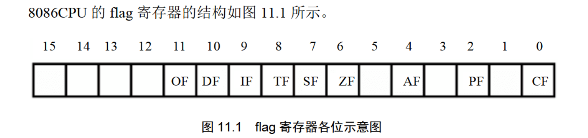
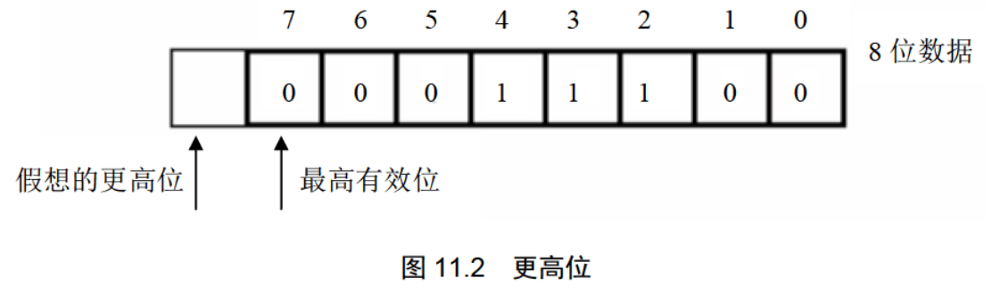

+++
date = '2026-07-30T20:19:00+08:00'
draft = false
title = '汇编语言'

categories = ["二进制","汇编语言"]
tags = ["二进制","汇编语言"]

+++

# 第10章	CALL和RET指令

## 10.1	ret和retf

## 10.2	call指令

## 10.3	依据位移进行转移的call指令

## 10.4	转移的目的地址在指令中的call指令

## 10.5	转移地址在寄存器中的call指令

## 10.6	转移地址在内存中的call指令

## 10.7	call和ret的配合使用

## 10.8	mul指令

## 10.9	模块化程序设计

## 10.10	参数和结果传递的问题

## 10.11	批量数据的传递

## 10.12	寄存器冲突的问题

# 第11章 标志寄存器

标志寄存器(flag)的作用：

1. 用来存储相关指令的某些执行结果；
2. 用来为CPU执行相关指令提供行为依据；
3. 用来控制CPU的相关工作。

## 11.1 ZF标志

flag的第6位 ZF 是 零标志位

结果为0，zf=1；	1表示逻辑真，即代表肯定“是0”这样的信息

结果不为0，zf=0。	0表示逻辑假，即否定含义，表示“结果不是0”

大多数运算指令对标志寄存器有影响，大多数传送指令大多数对标志寄存器没有影响。

## 11.2 PF标志

flag的第3位 PF 是 奇偶标志位

结果所有bit位中1的个数为偶数，pf=1；

结果所有bit位中1的个数为奇数，pf=0；

## 11.3 SF标志

flag的第3位 SF 是 符号标志位

结果为负，sf=1；

结果为非负，sf=0；

## 11.4 CF标志

flag的第0位 CF 是 进位标志位

在进行==无符号位==运算的时候，它记录了运算结果的最高有效位向更高位的进位值，或从更高位的借位值。

当更高位需要进位或者借位时，cf=1；

当更高位不需ddai要进位或者借位时，cf=0；

## 11.5 OF标志

flag的第0位 OF 是 溢出标志位

==有符号数运算==结果发生了溢出，OF=1；

==有符号数运算==结果没有发生溢出，OF=0；

## 11.6 adc指令

带进位加法指令

指令格式：adc 操作对象1，操作对象2

功能：操作对象1 = 操作对象1 + 操作对象2 + CF

例子： adc ax,bx 实现的功能是：(ax)=(ax)+(bx)+CF

## 11.7 sbb指令

带错位减法指令

指令格式：sbb 操作对象1，操作对象2

功能：操作对象1 = 操作对象1 - 操作对象2 - CF

例子： sbb ax,bx 实现的功能是：(ax)=(ax)-(bx)-CF

## 11.8 cmp指令

比较指令

指令格式：cmp 操作对象1，操作对象2

功能：计算 操作对象1 - 操作对象2 但不保存结果，仅仅根据计算结果对标志寄存器进行设置

例子： cmp ax,ax ，做(ax)-(ax)的运算，结果为0，但并不在ax中保存，仅影响flag的相关各位。指令执行后：zf=1，pf=1，sf=0，cf=0，of=0

cmp ax,bx

如果(ax)=(bx)则(ax)-(bx)=0，所以：zf=1;

如果(ax)≠(bx)则(ax)-(bx)≠0，所以：zf=0;

如果(ax)<(bx)则(ax)-(bx)将产生借位，所以：cf=1;

如果(ax)≥(bx)则(ax)-(bx)不必借位，所以：cf=0;

如果(ax)>(bx)则(ax)-(bx)即不必借位，结果又不为0，所以：cf=0并且zf=0;

如果(ax)≤(bx)则(ax)-(bx)即可能借位，结果可能为0，所以：cf=1或zf=1。

指令 cmp ax,bx 的逻辑含义是比较ax和bx中的值，如果执行后：

zf=1，说明(ax)=(bx)

zf=0，说明(ax)≠(bx)

cf=1，说明(ax)<(bx)

cf=0，说明(ax)≥(bx)

cf=0并且zf=0，说明(ax)>(bx)

cf=1或zf=1，说明(ax)≤(bx)

== 以上是cmp指令对无符号数进行比较，以下是有符号数 ==

cmp ah,bh

如果(ah)=(bh)则(ah)-(bh)=0，所以：zf=1;

如果(ah)≠(bh)则(ah)-(bh)≠0，所以：zf=0;

如果(ah)<(bh)则(ah)-(bh)将产生借位，所以：cf=1;

如果(ah)≥(bh)则(ah)-(bh)不必借位，所以：cf=0;

如果(ah)>(bh)则(ah)-(bh)即不必借位，结果又不为0，所以：cf=0并且zf=0;

如果(ah)≤(bh)则(ah)-(bh)即可能借位，结果可能为0，所以：cf=1或zf=1。
